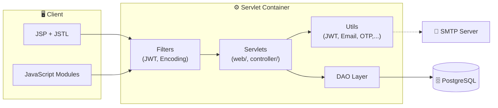
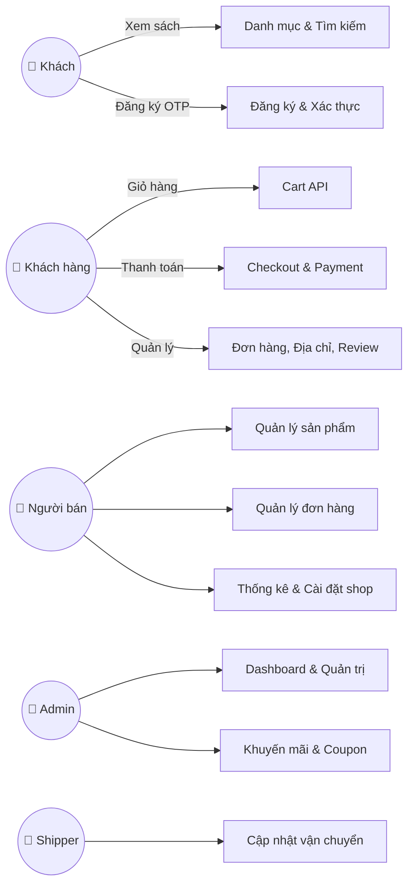
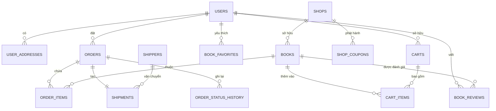

# 📚 JVA Bookstore

Nền tảng thương mại điện tử bán sách trực tuyến đa vai trò, được xây dựng bằng **Java Servlet + JSP** và **PostgreSQL**.

Hỗ trợ đầy đủ các vai trò: **Khách** · **Khách hàng** · **Người bán** · **Admin** · **Shipper**

---

## ⚙️ Công nghệ sử dụng

| Thành phần | Công nghệ |
|---|---|
| **Backend** | Java 11, Servlet 4.0, JSP/JSTL, Sitemesh 2 |
| **Database** | PostgreSQL (JSONB, INDEX), JDBC |
| **Bảo mật** | JWT (jjwt), BCrypt (jbcrypt) |
| **Build** | Maven, webapp-runner (Tomcat embedded) |
| **Email** | JavaMail (SMTP) |
| **Tiện ích** | Gson, Jackson, OpenCSV |
| **Triển khai** | Heroku / Render (Procfile) |

---

## 📁 Cấu trúc thư mục

```
JVA-bookstore/
├── pom.xml                     # Cấu hình Maven
├── Procfile                    # Cấu hình Heroku
├── app.json                    # Metadata Heroku
├── system.properties           # Java version cho Heroku
├── start-app.bat               # Script khởi động ứng dụng
├── start-server.bat            # Khởi động server local
├── start-tunnel.bat            # Khởi động Cloudflare tunnel
├── start-all.ps1               # Khởi động tất cả (PowerShell)
│
├── sql/                        # Các script SQL migration & seed
│   ├── example.sql             # Dữ liệu mẫu (category, shop, book,...)
│   ├── create_shops_table.sql  # Tạo bảng shops
│   └── *.sql                   # Các migration bổ sung
│
└── src/main/
    ├── java/
    │   ├── controller/         # Servlet điều hướng trang JSP
    │   │   └── admin/          # Servlet trang admin
    │   ├── dao/                # Data Access Objects
    │   │   ├── BookDAO.java
    │   │   ├── CartDAO.java
    │   │   ├── OrderDAO.java
    │   │   ├── ShipmentDAO.java
    │   │   ├── ShopDAO.java
    │   │   └── ...
    │   ├── filters/            # Servlet Filters
    │   │   ├── EncodingFilter  # Bắt buộc UTF-8
    │   │   └── JwtFilter       # Xác thực JWT
    │   ├── models/             # POJO entities
    │   │   ├── Book, Order, Cart, Shipment, Shop,...
    │   │   └── UserAddress, ShopCoupon,...
    │   ├── utils/              # Tiện ích dùng chung
    │   │   ├── DBUtil.java     # Kết nối DB, khởi tạo schema
    │   │   ├── JwtUtil.java    # Phát hành/xác thực JWT
    │   │   ├── EmailUtil.java  # Gửi email SMTP
    │   │   ├── OTPUtil.java    # Quản lý OTP
    │   │   └── ShippingCalculator.java
    │   └── web/                # REST API Servlets
    │       ├── AuthServlet.java
    │       ├── CartServlet.java
    │       ├── CheckoutServlet.java
    │       ├── ProfileServlet.java
    │       ├── admin/          # API quản trị
    │       └── seller/         # API người bán
    │
    ├── resources/
    │   ├── db.properties       # Cấu hình kết nối DB
    │   ├── email.properties    # Cấu hình SMTP
    │   ├── schema.sql          # Schema chính
    │   └── otp_schema.sql      # Schema OTP
    │
    └── webapp/
        ├── index.jsp           # Trang chủ
        ├── catalog.jsp         # Danh mục sách
        ├── book-detail.jsp     # Chi tiết sách
        ├── checkout.jsp        # Thanh toán
        ├── login.jsp           # Đăng nhập
        ├── register.jsp        # Đăng ký
        ├── profile.jsp         # Hồ sơ cá nhân
        ├── admin/              # Trang quản trị admin
        ├── Seller/             # Trang quản lý người bán
        ├── assets/             # CSS, JS, images
        └── WEB-INF/            # Sitemesh decorators, includes
```

---

## 🚀 Cài đặt & Chạy

### Yêu cầu

- **Java** 11+ (JDK)
- **Maven** 3.6+
- **PostgreSQL** 12+

### Bước 1: Cấu hình Database

1. Tạo database PostgreSQL:
   ```sql
   CREATE DATABASE jva_bookstore;
   ```

2. Cập nhật file `src/main/resources/db.properties`:
   ```properties
   db.url=jdbc:postgresql://localhost:5432/jva_bookstore
   db.user=postgres
   db.password=postgres
   ```

3. Chạy các script SQL theo thứ tự:
   ```bash
   # Schema chính
   psql -d jva_bookstore -f src/main/resources/schema.sql
   psql -d jva_bookstore -f src/main/resources/otp_schema.sql

   # Migration bổ sung (trong thư mục sql/)
   psql -d jva_bookstore -f sql/create_shops_table.sql
   psql -d jva_bookstore -f sql/apply_migration.sql

   # (Tùy chọn) Dữ liệu mẫu
   psql -d jva_bookstore -f sql/example.sql
   ```

### Bước 2: Build & Chạy

```bash
# Build WAR
mvn clean package

# Chạy server (port 8081)
java -jar target/dependency/webapp-runner.jar --port 8081 target/ROOT.war
```

Hoặc sử dụng script có sẵn:

| Script | Mô tả |
|---|---|
| `start-app.bat` | Build + khởi động server |
| `start-server.bat` | Khởi động server local (port 8081) |
| `start-tunnel.bat` | Tạo public URL qua Cloudflare tunnel |
| `start-all.ps1` | Khởi động tất cả (server + tunnel) |

**Khởi động nhanh (khuyến nghị):**
```powershell
# Cách 1: Dùng PowerShell
powershell -ExecutionPolicy Bypass -File start-all.ps1

# Cách 2: Double-click start-app.bat
```

### Bước 3: Truy cập

- **Local**: http://localhost:8081
- **Public**: URL hiển thị trong terminal tunnel (thay đổi mỗi lần khởi động)

---

## 🔑 Tài khoản test

| Vai trò | Username | Password |
|---|---|---|
| Khách hàng | `shino113399` | `123456` |
| Admin | `admin01` | `123456` |
| Người bán | `seller1` | `123456` |

---

## 🌐 Biến môi trường

| Biến | Mô tả | Mặc định |
|---|---|---|
| `DATABASE_URL` | URL kết nối PostgreSQL | Đọc từ `db.properties` |
| `JWT_SECRET` | Khóa bí mật JWT | Chuỗi mặc định trong code |
| `SMTP_HOST` | SMTP server | Đọc từ `email.properties` |
| `SMTP_PORT` | SMTP port | Đọc từ `email.properties` |
| `SMTP_USER` | SMTP username | Đọc từ `email.properties` |
| `SMTP_PASS` | SMTP password | Đọc từ `email.properties` |
| `SMTP_FROM` | Email người gửi | Đọc từ `email.properties` |
| `EMAIL_DISABLED` | Tắt gửi email (dev) | `false` |
| `BOOKSTORE_UPLOAD_DIR` | Thư mục upload media | Mặc định trong code |

---

## 🏗️ Kiến trúc hệ thống



---

## 📊 Sơ đồ chức năng



---

## 🗃️ Cơ sở dữ liệu

### Bảng chính

| Bảng | Mô tả |
|---|---|
| `users` | Tài khoản (role: admin, seller, customer, shipper) |
| `books` | Thông tin sách (liên kết shop) |
| `carts` · `cart_items` | Giỏ hàng persistent theo session/user |
| `orders` · `order_items` | Đơn hàng (JSONB: shipping, payment, coupon snapshot) |
| `order_status_history` | Lịch sử trạng thái đơn hàng |
| `shipments` · `shipment_events` | Theo dõi vận chuyển |
| `user_addresses` | Địa chỉ giao hàng |
| `shops` · `shop_settings` | Thông tin shop người bán |
| `coupons` · `shop_coupons` | Mã khuyến mãi chung & shop |
| `book_reviews` · `review_media` | Đánh giá & media |
| `book_favorites` · `recent_views` | Yêu thích & lịch sử xem |
| `shippers` | Đối tác giao hàng |
| `otp_verifications` | Xác thực OTP |

### Sơ đồ quan hệ



---

## ☁️ Triển khai (Heroku / Render)

Project đã cấu hình sẵn để triển khai trên Heroku:

```bash
# Đăng nhập Heroku
heroku login

# Tạo app
heroku create jva-bookstore

# Thêm PostgreSQL addon
heroku addons:create heroku-postgresql:hobby-dev

# Set biến môi trường
heroku config:set JWT_SECRET=your-secret-key

# Deploy
git push heroku main
```

Các file hỗ trợ triển khai:
- `Procfile` — lệnh khởi động cho Heroku
- `app.json` — metadata & addons
- `system.properties` — Java runtime version

---

## 🔧 Xử lý sự cố

| Lỗi | Giải pháp |
|---|---|
| Port 8081 đã sử dụng | `Get-NetTCPConnection -LocalPort 8081 \| ForEach-Object { Stop-Process -Id $_.OwningProcess -Force }` |
| Tunnel không kết nối | Kiểm tra server đã chạy tại http://localhost:8081 |
| `JAVA_HOME` không tìm thấy | Kiểm tra JDK 11+ đã cài, cập nhật đường dẫn trong file `.bat` |
| Lỗi kết nối DB | Kiểm tra PostgreSQL đang chạy, thông tin trong `db.properties` đúng |

---

## 📝 Ghi chú

- **Encoding**: `EncodingFilter` bắt buộc UTF-8 cho mọi request; `DBUtil` set `client_encoding = UTF8`.
- **Upload media**: Review hỗ trợ upload ảnh (≤5MB) và video (≤20MB), kiểm tra MIME type.
- **OTP**: Cooldown 2 phút, tối đa 5 lần thử.
- **Dữ liệu seed**: `BookDataLoader` tự động nạp sách từ CSV khi bảng `books` rỗng.
